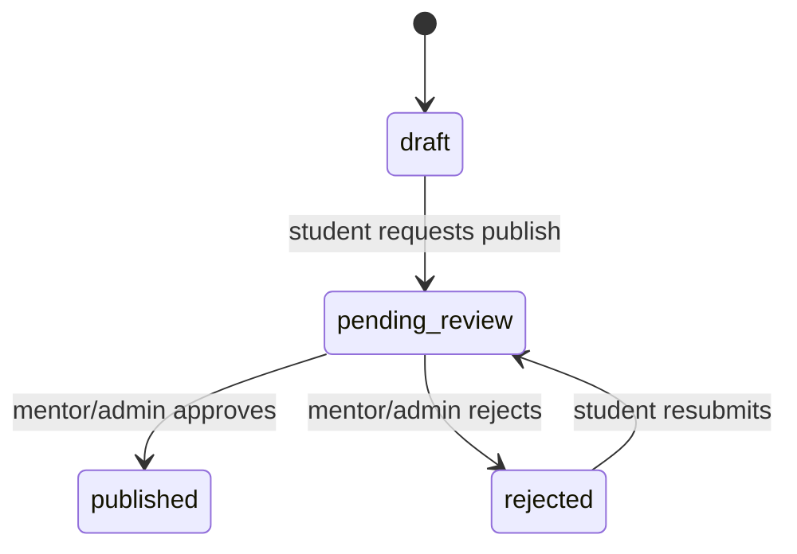

# RoboticGen Academy Projects — Architecture & Features

A single reference for what this platform is, how it's built, and what
each feature actually does in code today (not just what was planned).
For the original feature-by-feature planning doc (with open decisions
and DB rationale), see [`features.md`](./features.md) and
[`../database/README.md`](../database/README.md) — this doc consolidates
and updates both against the current implementation.

**Branch at time of writing:** `feature/submissions`.

---

## 1. What this is

An Instructables-style platform for RoboticGen learners:

- **Students** write step-by-step project write-ups (Markdown + images).
- **Mentors/Admins** review a project before it goes public.
- **The community** browses, searches, likes, stars, and builds from
  published projects — including submitting their own "I built this"
  write-up against someone else's project.

## 2. Tech stack

| Layer | Choice |
|---|---|
| Framework | Next.js 16 (App Router), React 19 |
| Auth | Auth.js v5 (NextAuth beta), Google OAuth only, JWT sessions |
| Relational DB | PostgreSQL 16, via Drizzle ORM (`postgres-js` driver) |
| Document DB | MongoDB 7 (official `mongodb` driver) |
| File storage | Private S3 bucket |
| Validation | Zod |
| UI | Tailwind CSS v4, a shadcn-style primitive kit in `components/ui/`, `@uiw/react-md-editor` for Markdown |
| Local infra | Docker Compose (`database/docker-compose.yml`) runs Postgres + Mongo |

No test framework (no Jest/Vitest/Playwright) is set up yet.

## 3. Architecture at a glance

Three stores, each doing the thing it's good at — this is the core
architectural decision of the whole project:

| Store | Owns | Why |
|---|---|---|
| **PostgreSQL** | users, roles, project/submission metadata, workflow state, likes, stars, denormalized counters | relational integrity, transactions, fast filtered/paginated reads |
| **MongoDB** | the Markdown *body* of every project and submission | free-form prose, no fixed shape, never queried relationally |
| **Local disk** | uploaded images | `media_assets` (Postgres) stores the path, not the bytes |

```mermaid
flowchart LR
    subgraph Client
        UI[Next.js App Router pages]
    end
    UI -->|server actions: auth, metadata, likes, review| PG[(PostgreSQL via Drizzle)]
    UI -->|server actions: read/write Markdown body| MDB[(MongoDB content_docs)]
    UI -->|upload via action, read via API route| DISK[(S3 bucket / S3_BUCKET)]
    PG -. content_doc_id .-> MDB
    PG -. media_assets.file_path .-> DISK
```

There is **deliberately no foreign key** between Postgres and Mongo —
Postgres owns workflow/metadata, Mongo owns prose, and the app code is
what ties `content_doc_id` to a Mongo `_id`.

Almost everything is a **Next.js Server Action** (`"use server"` files
under `src/actions/`), not REST endpoints. The only real API routes are
NextAuth's callback handler and the authenticated image-streaming route.

### Data flow, end to end

1. Student signs in with Google → row upserted into `users`, `role = student`.
2. Creates a draft project → a `projects` row (Postgres, `status = draft`) +
   an empty Markdown document (Mongo `content_docs`), linked by `content_doc_id`.
3. Edits title/summary/category/body/cover image/embedded images — Postgres
   and Mongo are both updated by the same server action.
4. Requests publish → `status: draft → pending_review`.
5. Mentor/admin reviews the Mongo body, approves (→ `published` +
   `is_featured = true`) or rejects (→ `rejected` + reason, resubmittable).
6. Once published: appears in search/browse and the Featured rail; the
   community can like, star, and submit their own builds against it.
7. All of the above rolls up into `user_dashboard_stats` (a Postgres view)
   for each user's dashboard.



## 4. Auth — how sign-in actually works

`frontend/src/auth.ts`, Auth.js v5:

- **Google only.** `signIn` callback rejects any other provider and
  rejects unverified Google emails (`profile.email_verified` must be true).
- **JWT sessions** (30-day maxAge), not database sessions — chosen
  deliberately because the Postgres schema has no `accounts`/`sessions`
  tables; `database/init/*.sql` stays the schema source of truth.
- **`jwt` callback**: on first sign-in, upserts a `users` row keyed on
  `google_id` (`onConflictDoUpdate`), refreshing email/displayName/
  avatarUrl/lastLoginAt every login. Role always comes from **our own
  `users.id`/`role` read**, never trusted from the Google payload — this
  is re-read from Postgres on every request so a mentor/admin promotion
  (granted out-of-band, no self-service) takes effect without re-login.
- **`session` callback** copies `token.id`/`token.role` onto
  `session.user` — the session only ever carries our own IDs, never
  Google's tokens.
- Custom sign-in/error page is `/landing`.

**Roles** (`user_role` enum): `student` (default) → build/draft/submit;
`mentor` → also approve/reject; `admin` → also manage the platform.
Role checks live in the server-action layer (`review.ts`'s
`requireReviewer`), not in the DB.

## 5. Database schema (Postgres)

Source of truth: `database/init/*.sql`, run once by Docker on first
volume creation (`004_tables.sql`, `005_views.sql`, etc.). Schema
changes after that go through **migrations**, never editing `init/*`
in place. `frontend/src/db/schema.ts` is a hand-maintained Drizzle
mirror for query typing — it does not drive the schema.

**Tables:** `users`, `projects`, `media_assets`, `project_likes`,
`project_stars`, `submissions`.

**Enums:** `user_role` (student/mentor/admin), `project_status`
(draft/pending_review/published/rejected), `media_owner_type`
(project/submission), `project_category` (10 fixed values: robotics,
electronics, iot, coding_software, ai_ml, drones, threed_printing,
sensors_automation, competitions, other).

**Views** (Drizzle `.existing()` — DDL owned by SQL):
- `user_dashboard_stats` — per-user draft/pending/published/rejected
  counts + likes/stars/submissions received, for the dashboard.
- `pending_review_queue` — the mentor/admin queue, oldest first.
- `user_liked_projects` / `user_starred_projects` — "my likes"/"my stars".

**Notable design details:**
- `like_count`/`star_count`/`view_count` on `projects` are **denormalized
  counters kept in sync by Postgres triggers** (`project_likes`/
  `project_stars` inserts/deletes), so the hot browse/card-grid read path
  never needs a `JOIN + COUNT`.
- `media_assets` is **polymorphic** (`owner_type` + `owner_id`), so
  projects and submissions share one gallery table. Postgres can't FK a
  column to two different tables, so ownership is enforced by triggers
  instead (`validate_media_asset_owner` rejects a bad `owner_id`;
  `cascade_delete_media_assets` cleans up on owner delete) — same effect
  as an FK, just not visible to Drizzle/Prisma as one.
- `projects.search_vector` is a generated, indexed `tsvector` for
  full-text search; a trigram GIN index on `title` supports typo-tolerant
  `ILIKE` matching; partial indexes are scoped to `status = 'published'`
  so draft/rejected rows never bloat the public-read indexes.
- A `CHECK` constraint (`chk_projects_review_fields`) requires
  `reviewed_by`+`reviewed_at` before a project can become `published` or
  `rejected` — an approval/rejection can't be silently skipped at the DB
  level. *Who* is allowed to do it (mentor/admin) is enforced in the app,
  not the DB.
- **Categories are a fixed enum, not a table** — adding one requires a
  migration (`ALTER TYPE ... ADD VALUE`), so there is no admin
  "create category" UI possible today without a schema change.

## 6. Markdown & images

- **Markdown body** lives in Mongo's single `content_docs` collection
  (`src/db/content.ts`: `createContentDoc`/`getContentDoc`/
  `updateContentDoc`/`deleteContentDoc`), referenced from Postgres by
  `projects.content_doc_id` / `submissions.content_doc_id`. Fully wired
  up (this was previously a gap — it's implemented now).
- **Images** are saved to a private S3 bucket under the key
  `<ownerType>/<ownerId>/<uuid>.<ext>` (`src/lib/storage.ts`). The bucket
  is never public-read. A `media_assets` row records the object key.
- The **only** way an uploaded image is ever served is
  `GET /api/media/[id]` (`src/app/api/media/[id]/route.ts`), which:
  1. looks up the `media_assets` row,
  2. checks visibility (a project's images are public once the project
     is published, or visible to its author otherwise; a submission's
     images are visible **only** to the submission's own author),
  3. streams the file with the right `Content-Type` and a cache policy
     that differs for public vs. private images.
- Upload is a server action, `uploadMediaAsset` (`src/actions/media.ts`):
  validates auth, `ownerType`, MIME type (png/jpeg/webp/gif only), size
  (5MB cap), and that the caller actually owns the project/submission,
  before writing to disk and inserting the DB row.

## 7. Feature-by-feature: what it does and how

### 7.1 Categories
Ten fixed values (`project_category` enum) used for filtering on
`/landing` and `/projects`. **Not admin-manageable** — changing the set
requires a Postgres migration, there's no `categories` table or admin
screen. (Open decision, unresolved: introduce a real `categories` table
if runtime admin management is required.)

### 7.2 Search & browse
`getFeaturedProjects` (`src/actions/projects.ts`) powers both
`/landing`'s featured rail and `/projects`' browse grid: title/summary
`ILIKE` search, category filter, pagination — all against real Postgres
data (not mocked), backed by the partial/GIN/trigram indexes above.

### 7.3 Accounts & publishing
Google sign-in auto-provisions a `users` row (§4). Publishing is a
one-way state machine students can't skip: `draft → pending_review →
published|rejected → (resubmit) → pending_review`. `requestPublish`
moves a project to `pending_review`; only `approveProject`/
`rejectProject` (mentor/admin only, `review.ts`) can move it out.
**Approval and Featured are the same action** in v1 — `approveProject`
sets `status=published` and `is_featured=true` together, even though the
schema keeps them as independent columns for a possible future split.

### 7.4 Community interaction
- **Like** (`project_likes`) / **Star** (`project_stars`) — one row per
  `(user, project)`, toggled by `toggleLike`/`toggleStar` (insert-or-
  delete), counters kept current by DB triggers, UI in
  `like-button.tsx`/`star-button.tsx`.
- **Submissions** (`submissions`) — a learner's own "I made it" write-up
  against a project. `createSubmission`:
  - requires the target project to be `published` **and** `is_featured`,
    *unless* the submitter is that project's own author (no such gate
    for your own project),
  - forces `is_private = true` for anyone who isn't the project's
    author, regardless of what the form sends — the one exception where
    a submission can be public is a project author submitting against
    their *own* project,
  - creates its own Mongo content doc, same pattern as a project.
  - Multiple submissions per project are allowed (no unique constraint).
  - Read paths: `getMySubmissions`, `getPublicSubmissionsForProject`
    (public-only, shown on the project page as "Community builds"),
    `getPublicSubmission`/`getSubmissionById` (owner-only for private
    ones — **nobody but the submitter can ever read a private
    submission, not even the project's author**).

### 7.5 Markdown storage + editor/viewer
Fully implemented (previously the biggest gap, now closed): Mongo client
(`db/mongo.ts`, connection cached on `globalThis` in dev for hot-reload
safety), content CRUD (`db/content.ts`), a Markdown editor with slash
commands and embed support (`markdown-editor.tsx`, `slash-command-menu.tsx`,
`embed-block.tsx`, `lib/embeds.ts`), a viewer (`markdown-viewer.tsx`), and
image upload wired into the editor toolbar (`cover-image-upload.tsx` +
`uploadMediaAsset`).

### 7.6 Dashboard + avatars
`getDashboardStats` reads the `user_dashboard_stats` view — draft/
pending/published/rejected counts, likes/stars/submissions received.
`/dashboard` renders this plus tabs for My Projects / My Submissions /
Starred Projects, all backed by real queries (`dashboard-stats.tsx`,
`dashboard-sidebar.tsx`).
**Avatars**: still Google's profile picture (`avatar_url`), refreshed on
every login — the DiceBear-seeded-avatar idea from the original brief
was never implemented; this is an open decision, not a bug.

### 7.7 Mentor/admin review queue
`/dashboard/review` — lists `pending_review_queue` (oldest first),
`/dashboard/review/[slug]` shows one project's Markdown body for the
mentor/admin to read before deciding. `approveProject`/`rejectProject`
are gated by `requireReviewer` (role check) inside the server action
itself, not just hidden in the UI. Rejecting requires a reason (≥5
chars) so the student always gets actionable feedback.

## 8. UI structure notes

- Routing uses a Next.js **parallel route + intercepting route**
  (`app/@modal/(...)...`) to open a project/submission/edit view as a
  **slide-in panel** over the current page instead of a full navigation,
  falling back to a normal full page on direct link/refresh
  (`slide-panel.tsx`, `slide-panel-stack.tsx`).
- `components/ui/` is a shadcn-style primitive kit (button, dialog,
  tabs, select, etc.) that the feature components build on.
- `app/ui/page.tsx` is a dev-only kitchen-sink/style-reference page, not
  part of the real product surface.

## 9. Environment variables (`frontend/.env.example`)

| Var | Purpose |
|---|---|
| `DATABASE_URL` | Postgres connection string |
| `MONGODB_URI` / `MONGODB_DB` | Mongo connection |
| `S3_BUCKET` / `S3_REGION` | private S3 bucket for uploaded images |
| `AWS_ACCESS_KEY_ID` / `AWS_SECRET_ACCESS_KEY` | S3 credentials (or use an IAM role) |
| `S3_ENDPOINT` | optional S3-compatible endpoint (e.g. local MinIO) |
| `CLIENT_ID` / `CLIENT_SECRET` | Google OAuth credentials |
| `AUTH_SECRET` | Auth.js JWT signing secret |

No email or analytics vars exist — those integrations
aren't part of the system.

## 10. Known gaps / open decisions

Carried over from `features.md`, still unresolved as of this doc:

1. **Categories**: enum vs. a real `categories` table for admin
   management (§7.1) — needs a migration decision before building.
2. **Approval = Featured**: v1 treats them as one action (§7.3) — confirm
   or split later; schema already supports splitting without a migration.
3. **"Star" semantics**: confirmed here as "I'm going to build this"
   bookmark, distinct from Like — flag if the original brief meant
   something else.
4. **Avatar source**: still Google's photo, DiceBear was never wired in
   (§7.6) — decide DiceBear-always vs. DiceBear-as-fallback if desired.
5. **No test suite** — no Jest/Vitest/Playwright configured yet.
6. **Image bytes are proxied through the app** — `/api/media/[id]`
   streams from S3 so it can enforce visibility; published images could
   later move to a CDN or pre-signed URLs if bandwidth becomes an issue.
