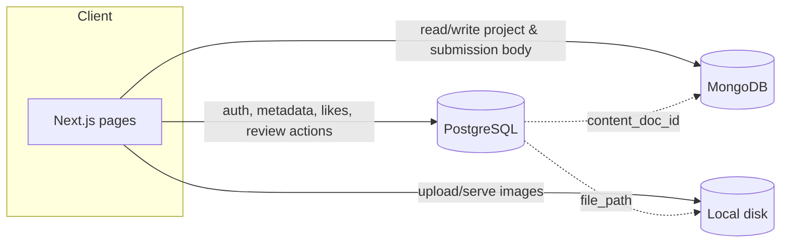
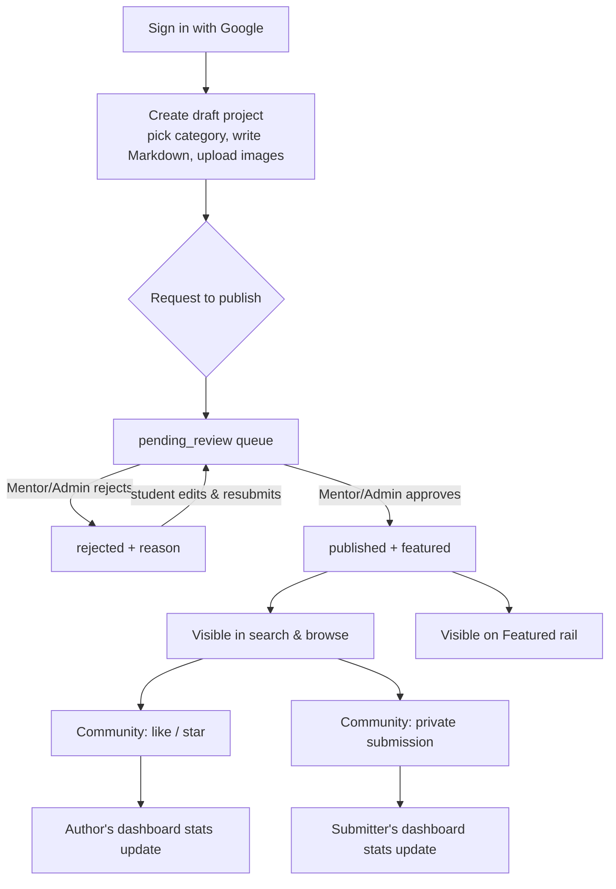
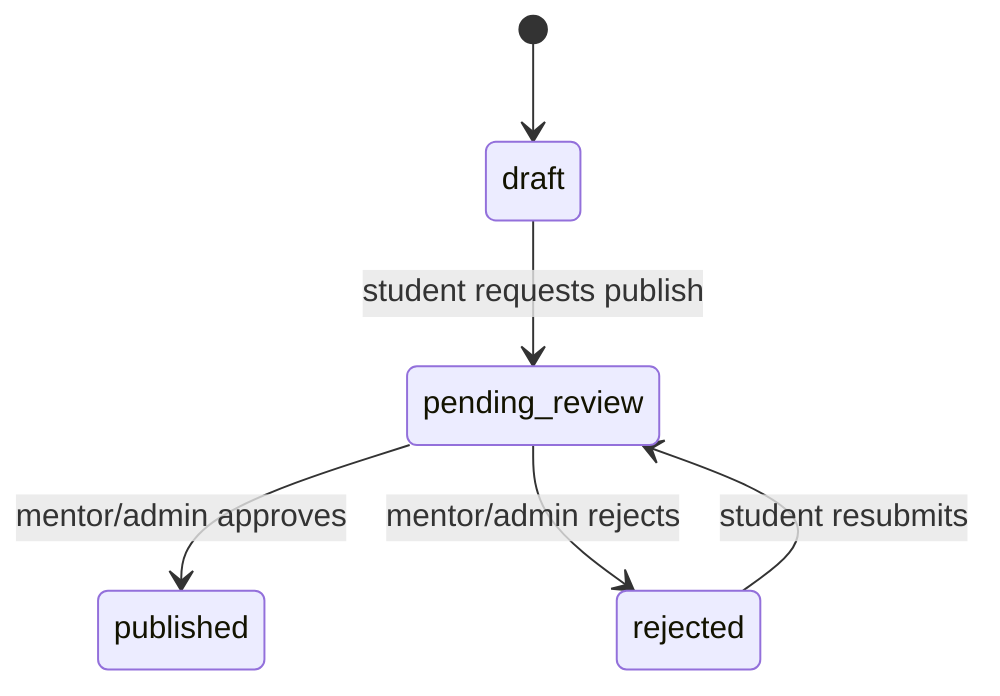

# Feature reference — RoboticGen Projects

An Instructables-style platform for RoboticGen learners: students publish
step-by-step project write-ups, mentors/admins review them before they go
public, and the community likes, stars and builds from them.

This doc is the reference for the six features that make up v1. Each
section explains **what it is, who touches it, how data flows, and what's
already built vs. still open** — so it stays useful as implementation
catches up with the plan, instead of going stale the moment code lands.

## Architecture at a glance

Three stores, split by what they're good at:

| Store | Owns | Why |
|---|---|---|
| **PostgreSQL** (Drizzle ORM) | Users, roles, project/submission metadata, workflow state, likes, stars | Needs relational integrity, transactions, fast filtered/paginated reads |
| **MongoDB** | The Markdown body of every project and submission | Free-form prose, no fixed shape, not queried relationally |
| **Local disk** | Uploaded images | `media_assets` (Postgres) stores the path, not the bytes |



Auth is Google OAuth only, via [Auth.js v5](https://authjs.dev) with JWT
sessions — see `frontend/src/auth.ts`. There is no local password and no
other identity provider.

Schema source of truth: `database/init/*.sql` (see `database/README.md`
for the full design rationale). `frontend/src/db/schema.ts` is a
hand-maintained Drizzle mirror of it.

## Main flow, end to end

The six features aren't independent — they chain into one path a project
takes from idea to public, plus the side-paths for private practice and
community reaction. Three actors, three flows below; together they cover
every feature in this doc.

### A. Student — build and publish a project

1. **Sign in with Google** (feature 3). First-ever sign-in creates a
   `users` row, `role = student` by default.
2. **Start a draft.** Pick a **category** (feature 1) and start writing —
   title, summary, and the step-by-step body in the **Markdown
   editor** (feature 5). `status = draft`; only the author can see it.
3. **Add images** to the write-up via the editor's upload — each one
   lands on local disk and gets a `media_assets` row (feature 5).
4. **Save and keep editing**, any number of times, while `status =
   draft`. Nobody else can see it yet.
5. **Request to publish.** `status: draft → pending_review`. The project
   now enters the mentor/admin review queue (`pending_review_queue`).
6. **Wait for review** (flow B, below).
   - **Rejected** → `status = rejected`, with a `rejection_reason` the
     student can read. They edit and resubmit → back to
     `pending_review` (step 5).
   - **Approved** → `status = published`, `is_featured = true` (v1 treats
     these as the same event — see [§3](#3-user-accounts--publishing)).
     The project is now public, in **search & browse** (feature 2), and
     on the **Featured** rail.
7. **Track it on the dashboard** (feature 6): draft/pending/published/
   rejected counts, likes and stars received, all from
   `user_dashboard_stats` — updates automatically as steps above happen.
8. **Submit your own build against your own project**, any time (feature
   4) — the one case where you can publish a submission instead of
   keeping it private, since it's your own work. It then shows on the
   project's public "Community builds" list.

### B. Mentor / Admin — review queue

1. **Sign in with Google**, same as any user — role is `mentor` or
   `admin` (granted out-of-band, never self-service).
2. **Open the review queue** — `pending_review_queue`, oldest submission
   first.
3. **Read the project's Markdown body** (feature 5) and check it's a
   real, followable write-up.
4. **Decide:**
   - **Approve** → sets `status = published`, `is_featured = true`,
     `reviewed_by`/`reviewed_at` (required together by
     `chk_projects_review_fields`). Project appears in search/browse and
     Featured immediately.
   - **Reject** → sets `status = rejected` with a `rejection_reason`,
     same `reviewed_by`/`reviewed_at` requirement. Student can resubmit
     (flow A, step 6).
5. *(Admin only, once feature 1's table migration lands)* **Manage
   categories** — create, rename, or retire the categories students pick
   from in flow A, step 2.

### C. Visitor / community member — discover and react

1. **Browse or search** published projects (feature 2) — by keyword,
   filtered by category, paginated. No login required.
2. **Open a project**, read the Markdown write-up and its images
   (feature 5).
3. **Like** it (feature 4) — a quick "I like this," bumps `like_count`.
   *Requires being signed in.*
4. **Star** it (feature 4) — "I'm going to build this," bumps
   `star_count`. Also requires sign-in.
5. **Build it and submit** their own attempt (feature 4): a write-up in
   the same Markdown editor (feature 5), against that project.
   `is_private = true` by default — **only they** can ever read it back,
   not even the project's original author. (Building against *your own*
   project is the one case where you can choose to publish it instead —
   see flow A below.)
6. **Track their own activity** on their dashboard (feature 6): their
   submission count, and — if they've also published projects of their
   own — the same stats as flow A, step 7.



## Status snapshot

| # | Feature | DB schema | API | UI |
|---|---|---|---|---|
| 1 | Categories | ⚠️ built as fixed enum, not admin-manageable — see [below](#1-categories) | ❌ | 🟡 static demo on `/landing` |
| 2 | Search & browse pagination | ✅ indexes in place | ❌ | 🟡 static demo on `/landing` |
| 3 | Accounts & publishing | ✅ | 🟡 login only, review actions not built | 🟡 sign-in wired, no dashboard/review screens |
| 4 | Community interaction | ✅ likes/stars/submissions tables | ✅ toggle + create/list actions | ✅ like/star buttons, submission form + project-page builds list |
| 5 | Markdown storage + editor/viewer | ✅ Postgres side (`content_doc_id`) · ❌ Mongo not wired up yet | ❌ | ❌ removed from landing, not rebuilt |
| 6 | Dashboard + DiceBear avatars | ✅ `user_dashboard_stats` view · ⚠️ avatar source conflicts with Google-sourced `avatar_url` — see [below](#6-dashboard--avatars) | ❌ | ❌ removed from landing, not rebuilt |

✅ done · 🟡 partial · ❌ not started · ⚠️ needs a decision before building

---

## 1. Categories

**What:** Projects are filed under one category (Robotics, Electronics,
IoT, 3D Printing, …) for browsing and filtering. Per the brief, an admin
should be able to create/rename/retire categories at runtime.

**Current schema conflicts with that.** `project_category` is a fixed
Postgres `enum` (`database/init/002_types.sql`), not a table — the only
way to add a value today is a migration (`ALTER TYPE ... ADD VALUE`),
which is not something an admin screen can trigger. This was a deliberate
tradeoff for the original design (simpler indexes, no join to look up a
category name) but it doesn't match "admin can create categories."

**Decision needed:** introduce a real `categories` table:

```
categories
  id          uuid PK
  name        text unique
  slug        text unique
  icon        text        -- optional, e.g. a lucide icon name
  created_by  uuid  REFERENCES users(id)
  created_at  timestamptz
```

and change `projects.category` from the enum to `category_id uuid
REFERENCES categories(id)`. This is a real schema migration (not a
`schema.ts` edit) — plan it alongside whichever feature ships first.

**Who:** Admin only creates/edits/retires categories. Everyone browses by
category.

## 2. Search & browse, paginated

**What:** Full-text search over published projects, optionally filtered
by category, paginated.

**Already built (Postgres side):**
- `projects.search_vector` — a generated, indexed `tsvector` (title
  weighted above summary) for ranked full-text search.
- A trigram GIN index on `title` for typo-tolerant / `ILIKE` matching.
- Partial indexes scoped to `status = 'published'` for the public feed,
  the per-category feed, and the featured rail — draft/rejected rows
  never bloat what the public actually reads.

**Still open:** the API route(s) that accept a query + category + page
params and return paginated results, and the browse UI wired to real data
(the `/landing` page's search bar and project grid are static mock
content today, not a working search).

**Who:** Public — no login required to search or browse published
projects.

## 3. User accounts & publishing

**Login:** Google only, via Auth.js. See `frontend/src/auth.ts`:
- Rejects any provider other than Google and any unverified Google email.
- On first sign-in, upserts a row into `users` keyed by `google_id`,
  defaulting `role` to `student` (the Postgres column default — never
  trusted from the OAuth payload itself).
- Session is a JWT (httpOnly, encrypted with `AUTH_SECRET`), carrying only
  our own `users.id` and `role` — never Google's tokens.

**Roles** (`user_role` enum: `student | mentor | admin`):

| Role | Can do |
|---|---|
| **Student** (default) | Build projects as drafts, request publish, make private submissions |
| **Mentor** | Everything a student can, plus approve/reject pending projects |
| **Admin** | Everything a mentor can, plus manage categories and oversee the platform |

**Publish workflow.** A student cannot publish directly. `projects.status`
moves through:



A `CHECK` constraint (`chk_projects_review_fields`) requires
`reviewed_by` + `reviewed_at` to be set before a project can be
`published` or `rejected` — an approval can't be silently skipped at the
DB level. What the DB does **not** enforce is *who* is allowed to make
that transition — that a caller has `role IN ('mentor', 'admin')` has to
be checked in the API layer before it writes the status change. That
check does not exist yet.

**Approval ⇒ Featured, for v1.** The brief says an approved project
"will show in featured projects" — read literally, v1 treats *published*
and *featured* as the same event: the mentor/admin action that approves a
project also sets `is_featured = true`. The schema keeps them as
independent columns (`status` and `is_featured`) on purpose, so a later
version can split them apart — e.g. publish anyone can see, featured as a
separate curation pass on top — without a schema change, just a change in
what the approval action sets.

**Who:** Every signed-in user is a student by default. Mentor/admin is
granted out-of-band (there is no self-service "become a mentor" flow, and
none should exist).

## 4. Community interaction

Three separate signals, each already modeled in Postgres:

- **Like** (`project_likes`) — a simple "I like this," one row per
  `(user, project)`. `projects.like_count` is a denormalized counter kept
  in sync by a trigger, so the browse feed never needs a `JOIN + COUNT`.
- **Star** (`project_stars`) — distinct from a like: "I'm going to build
  this." Same one-row-per-user shape, own denormalized `star_count`.
  (If "star features project" in the brief meant something else, flag it
  — this doc assumes it's the bookmark/"I'm building this" signal, since
  that's what the schema already models.)
- **Submissions** (`submissions`) — a learner's own "I made it" write-up
  against a project, `is_private` defaulting to `true`. A submission
  **against someone else's project** is always private — nothing grants
  that project's author or a mentor visibility into it, **only `user_id`
  can read it, full stop**. A submission against **your own** project is
  the one exception: you (the author) can choose to publish it, and it
  then shows publicly on the project page's "Community builds" list —
  everyone else still only ever gets the private, author-only default.
  Multiple submissions per project are allowed (no unique constraint),
  since a learner might rebuild and want a second write-up.

  Creating a submission against someone else's project requires that
  project to be `published` **and** `is_featured` (in v1 these are set
  together, see [§3](#3-user-accounts--publishing)); creating one against
  your own project has no such gate.

  Built: `createSubmission`/`getMySubmissions`/`getSubmissionById`/
  `getPublicSubmission`/`getPublicSubmissionsForProject`
  (`frontend/src/actions/submissions.ts`), the write-up form with a
  public/private switch (`submission-form.tsx`, only shown to the
  project's own author), `app/projects/[slug]/submissions/new` (create)
  and `app/projects/[slug]/submissions/[id]` (view a public one), plus
  the "Community builds" list and "I built this" CTA on the project
  detail panel.

**Still open:** the like/star toggle UI is wired (`like-button.tsx`,
`star-button.tsx`); nothing left for feature 4 beyond polish.

**Explicitly out of scope for v1:** sharing a *private* submission with
anyone else (including the project's own author) — that would need an
explicit new grant mechanism, not a flag flip on the existing schema. A
public submission is only ever public because its own author chose that,
never because of a grant to a third party.

## 5. Markdown storage + a viewer/writer

Every project's and submission's write-up is a list of Instructables-style
steps (title, image gallery, Markdown body per step), stored in **MongoDB**
— `projects.content_doc_id` / `submissions.content_doc_id` in Postgres
hold that document's Mongo `_id`. There is deliberately no foreign key
between the two databases; Postgres owns workflow/metadata, Mongo owns
prose, and the app is what ties the two IDs together.

Images referenced from those steps are **not** in Mongo or Postgres —
they're objects in a private S3 bucket, tracked by `media_assets`
(`owner_type` + `owner_id` pointing at a project or submission,
`file_path` holding the S3 object key).

**Still open, and not yet started:**
- No MongoDB client/connection exists in the codebase yet (Postgres via
  Drizzle is wired up; Mongo isn't).
- No image upload endpoint that writes to local disk and records a
  `media_assets` row.
- No editor/viewer UI. An earlier landing-page mock showed the intended
  shape — a two-tab **Write** (raw Markdown) / **Preview** (rendered)
  panel — but it was a static mock and has since been removed from the
  landing page; the real thing needs a Markdown editor component, a
  renderer for the preview tab, and image-upload wired into the editor
  toolbar.

## 6. Dashboard + avatars

**Stats.** `user_dashboard_stats` (a Postgres view, already built) gives
per-user counts in one query: draft/pending/published/rejected project
counts, total likes and stars received, and submission count. This is
exactly the shape a small personal dashboard needs — no new schema
required, just the UI and a route that selects from the view.

**Avatars via DiceBear** — this conflicts with the current design.
`database/README.md` and `frontend/src/auth.ts` both currently treat
`users.avatar_url` as *the Google profile picture*, refreshed from Google
on every login. DiceBear (a generated, seeded avatar — e.g.
`https://api.dicebear.com/9.x/adventurer/svg?seed=<seed>`) is a different
source entirely.

**Decision needed** before building this:
1. Generate the DiceBear URL **once**, at first account creation (seeded
   by `google_id` so it's stable per user), and stop overwriting
   `avatar_url` from Google on subsequent logins — i.e. DiceBear becomes
   the actual identity picture, Google's photo is never used. This
   matches "use DiceBear for profile image creation" literally, but means
   changing the `jwt` callback in `auth.ts`, which today unconditionally
   sets `avatarUrl` from Google's `picture` claim on every sign-in.
2. Keep Google's photo as the default and only fall back to a
   DiceBear-generated avatar when Google doesn't return one (rare, but
   possible) — smaller change, doesn't fully satisfy "use DiceBear."

Whichever is chosen, no schema change is needed — `avatar_url` already
just stores a URL, generated or not.

**Still open:** the dashboard UI itself (also removed from the landing
page mock) and the route/query against `user_dashboard_stats`.

---

## Open decisions, collected

For quick reference — everything above that needs a call before or during
implementation:

1. **Categories**: enum → table migration (admin-manageable), see [§1](#1-categories).
2. **Approval = Featured**: confirm v1 treats them as one action, or wants them split from day one, see [§3](#3-user-accounts--publishing).
3. **"Star"**: confirm it means the existing `project_stars` "I'm building this" bookmark, see [§4](#4-community-interaction).
4. **Avatar source**: DiceBear-always vs. DiceBear-as-fallback, and updating `auth.ts` accordingly, see [§6](#6-dashboard--avatars).

## Explicitly out of scope for v1

- Any login method other than Google.
- Self-service role upgrade (student → mentor/admin) — granted out-of-band only.
- Sharing a private submission with anyone but its author.
- Editing/deleting a category's underlying enum value without a migration (until §1's table migration lands).
